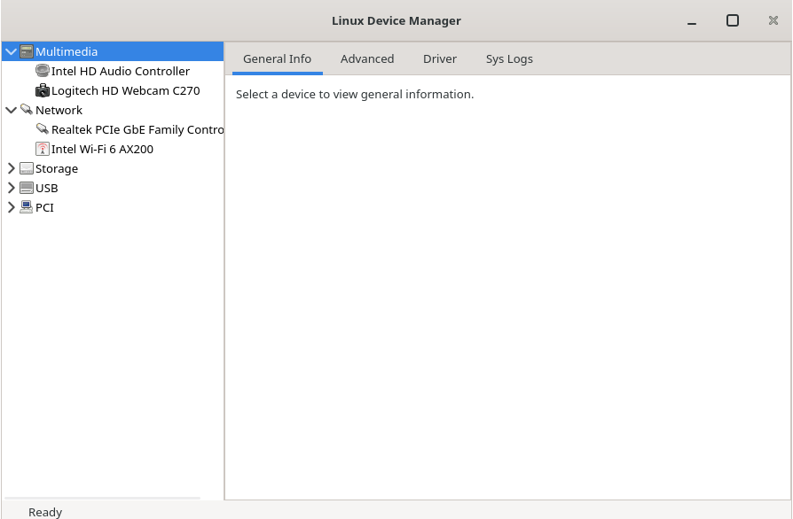

# Linux Device Manager

A Windows Device Manager-like graphical tool for Linux. Provides a clean, category-based interface to view, inspect, and manage hardware devices via sysfs/udev.



## Features

- **Category tree** — devices grouped by type: Multimedia, Network, Storage, USB, PCI, etc.
- **Detail tabs** — General info, Advanced details, Driver info, Kernel logs/events
- **Device actions** — Enable / Disable devices (via polkit-protected privileged helper)
- **Status bar** — Spinner and progress indicators for long-running operations
- **GTK4 UI** — Defined via Cambalache `.ui` file (no programmatic widget creation)

## Architecture

Multi-module Maven project:

| Module | Path | Description |
|--------|------|-------------|
| `core` | `core/` | Device enumeration, categorization, detail providers, action service |
| `gui-gtk` | `gui-gtk/` | GTK4 UI (java-gi bindings) |
| `gui-qt` | `gui-qt/` | Qt UI — **V2 (planned)** |

Device data is gathered from sysfs, udev, and system tools (`lspci`, `lsusb`, `lshw`, `dmesg`, `modinfo`, etc.). Embedded static binaries are preferred over OS dependencies.

## Prerequisites

| Tool | Version | Notes |
|------|---------|-------|
| JDK | 25+ | java-gi GTK binding targets OpenJDK 25 |
| Maven | 3.8+ | Build and tests |
| `dpkg-deb` | — | Debian package assembly (Debian/Ubuntu only) |

If the default `java` is older than 25, set `JAVA_HOME` before running Maven:

```sh
JAVA_HOME=/usr/lib/jvm/java-25-openjdk-amd64 mvn test
```

## Build

```sh
# Compile and run tests
mvn test

# Compile only (skip tests)
mvn install -DskipTests
```

## Package

### Debian / Ubuntu (.deb)

The .deb bundles a trimmed JRE (via `jlink`), application JARs, a launcher script, a polkit-protected privileged helper, a `.desktop` entry, and an SVG icon.

```sh
# Build the .deb (default)
JAVA_HOME=/usr/lib/jvm/java-25-openjdk-amd64 packaging/build-deb.sh

# Or via Maven profile
JAVA_HOME=/usr/lib/jvm/java-25-openjdk-amd64 mvn package -Ppackage-deb -DskipTests
```

Output: `packaging/dist/linux-device-manager_0.1.0-1_amd64.deb`

### Verify the .deb

```sh
packaging/verify-deb.sh
```

### Install

```sh
sudo dpkg -i packaging/dist/linux-device-manager_0.1.0-1_amd64.deb
```

Installed layout:

| Path | Content |
|------|---------|
| `/opt/linux-device-manager/runtime/` | Trimmed JRE (jlink) |
| `/opt/linux-device-manager/lib/` | Application JARs + dependencies |
| `/usr/bin/linux-device-manager` | Launcher script |
| `/usr/libexec/ldm-helper` | Privileged device helper |
| `/usr/share/polkit-1/actions/org.ldm.policy` | Polkit policy |
| `/usr/share/applications/linux-device-manager.desktop` | Desktop entry |
| `/usr/share/icons/hicolor/scalable/apps/linux-device-manager.svg` | App icon |

### Uninstall

```sh
sudo dpkg -r linux-device-manager
```

### AppImage

Deferred for V1 (GTK4 library bundling in AppImage is non-trivial).

## Roadmap

- **V1** — Complete functionality with GTK4 UI
- **V2** — Qt UI with all V1 features

## Development

```
linux-device-manager/
├── core/                   # Core device management library
├── gui-gtk/                # GTK4 UI (java-gi)
├── gui-qt/                 # Qt UI (planned)
├── helper/                 # Privileged helper script + polkit policy
├── packaging/              # .deb build scripts, desktop files, control files
└── docs/                   # Design specs and implementation plans
```
